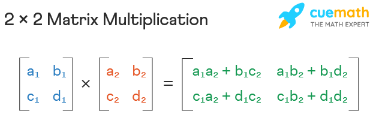

# Hill Cipher
### By: Rian Alif and Phillip Guan

## Lester S. Hill
- Creator of the Hill Cipher
- Introduced Hill Cipher in 1929

## What is the Hill Cipher?
- Polygraphic substitution cipher based on linear algebra.
  - Matrix Multiplication
  - Modular Arithmetic

## Why was the Hill Cipher created?
- To create a cipher more secure than a simple substitution cipher and transposition cipher
  - Substitution Cipher: an encryption method in which each letter in the message is replaced by another letter or symbol according to a secret key.
    - Some problems with this include the fact that it is very easy to attack. All you need is to run some frequency analysis on it.
  - Transposition Cipher: a method of encryption that rearranges the characters or bits in the plaintext according to a certain system, all while maintaining their original identity.
    - Problems with this cipher include the fact that it can also be broken with frequency analysis
    - Also note that one single error in the encryption or transmission can make a large portion of the message unreadable

## Hill Cipher: Strengths
- One of the first polygraphic ciphers to be practical and implemented.
  - A polygraphic cipher is when you perform substitutions with two or more groups of letters
- Cannot be attacked using frequency analysis.
  - The matrix multiplication that the cipher goes through provides diffusion

## Hill Cipher: Weaknesses
- Vulnerable to brute force attacks, especially when block size is small and the key is weak.
- Vulnerable to known plaintext attacks

## Encryption Process
1. Key Selection
    - choose a (N x N) invertible matrix as the key
    - the numbers in this matrix should be integer values between 0-25

2. Changing the plaintext
    - Divide the plaintext into blocks of "n" letters each. If final block is incomplete, pad it with an extra letter.
    - Convert the letters to numbers with "A = 0", "B = 1", and so on until "Z = 25"
    - Form each block of letters into a column vector.

3. Matrix multiplication
    - Multiply Key Matrix with Plaintext Matrix
    - Mod each number of the resulting matrix by 26
    - Convert those numbers back to letters based on the pairings of values (A = 0, B = 1, etc)
